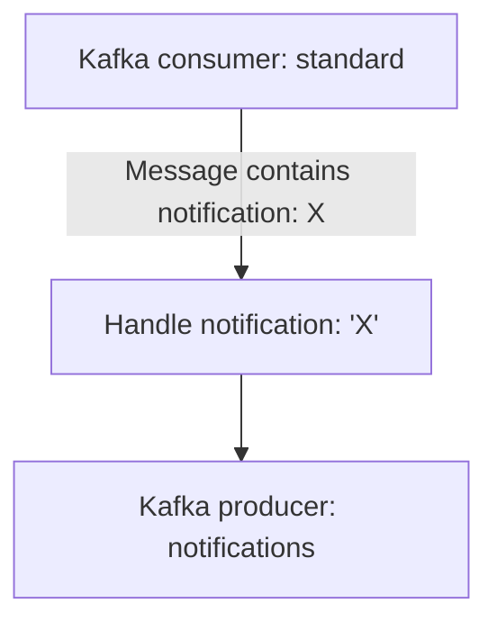

# Live Timing Strategy - Pipeline

## Introduction

Pipelines to retrieve and analyse the data coming from the live timing.

## Setup for development

For development, we also need to install these tools:
- Python 3.10 or greater: https://www.python.org/
- (Optional) Visual Studio: https://code.visualstudio.com/

Linux:
```sh
python -m venv .venv
source .venv/bin/activate
python -m pip install tox==4.11 poetry==1.6.1
poetry config virtualenvs.create false
```

Windows:
```sh
python -m venv .venv
.\.venv\Scripts\activate
python -m pip install tox==4.11 poetry==1.6.1
poetry config virtualenvs.create false
```

> In Windows, if there is any error similar to "running scripts is disabled",
  use this command: `Set-ExecutionPolicy Unrestricted CurrentUser`.

### Adding more dependencies

Every time we add more dependencies, we'll need to update the lock file. For
this purpose, use this command while we are in the virtual env:
```sh
poetry lock --no-update
```

> Tip: in case that Poetry is slow to resolve the dependencies, try to clear its
  cache: `poetry cache clear --all <name>`

## Pipeline

### Pipeline: Notification Listener

This script has a single process that listens in the topic of Kafka where the
notifications are written. Then, depending on the notification, it might
trigger some computation of strategies.



Local Python command:
```sh
python -m ltspipe.runners.notifications_listener \
  --api_lts http://localhost:8090 \
  --competition_code competition-test \
  --kafka_servers localhost:9092 \
  --verbosity 1
```

Arguments:
- `--api_lts`: (**mandatory**) URI of API REST of LTS app.
- `--competition_code`: (**mandatory**) Code of the competition.
- `--errors_path`: (optional) Path to store errors in running time. By default,
  it is `artifacts/notifications-listener/errors/`.
- `--kafka_group`: (optional) Suscribe to the topic with a specific group name. 
  By default, it is `notifications-listener`.
- `--kafka_notifications`: (optional) Topic of Kafka to read and write
  notifications. By default, it is `notifications`.
- `--kafka_servers`: (**mandatory**) List of Kafka brokers separated by commas.
  Example: `localhost:9092,localhost:9093`.
- `--verbosity`: (optional) Level of verbosity of messages. The values can be
  `0` to disable messages, `1` for debug (or greater), `2` for info (or
  greater), ... and `5` for critical. By default, it is `2`.

### Pipeline: Websocket Parser

The script of messages parsing for websocket is composed by two processes:
- One handles the notifications.
- The other is the one that parses the message data and transform it into
  something that we can store in the database.

Additionally, this script might connect to the API REST to get information, such
as settings to parse the data.

Local Python command:
```sh
python -m ltspipe.runners.ws_parser \
  --competition_code competition-test \
  --api_lts http://localhost:8090 \
  --kafka_servers localhost:9092 \
  --websocket_uri ws://www.apex-timing.com:8092 \
  --verbosity 1
```

python -m ltspipe.runners.ws_parser --competition_code competition-test --api_lts http://localhost:8090 --kafka_servers localhost:9092 --websocket_path artifacts/only-raw_santos-26h-23-09-2023 --verbosity 1

Arguments:
- `--api_lts`: (**mandatory**) URI of API REST of LTS app.
- `--competition_code`: (**mandatory**) Code of the competition.
- `--errors_path`: (optional) Path to store errors during parsing. By default,
  it is `artifacts/ws-parser/errors/`.
- `--kafka_notifications`: (optional) Topic of Kafka to read and write
  notifications. By default, it is `notifications`.
- `--kafka_produce`: (optional) Topic of Kafka to write messages. By default,
  it is `standard`.
- `--kafka_servers`: (**mandatory**) List of Kafka brokers separated by commas.
  Example: `localhost:9092,localhost:9093`.
- `--unknowns_path`: (optional) Path to store unknown data (i.e. not recognized
  by any parser). By default, it is `artifacts/ws-parser/unknowns/`.
- `--websocket_path`: (**mandatory** if `websocket_uri` is empty) Path with
  websocket files to reproduce a competition.
- `--websocket_uri`: (**mandatory** if `websocket_path` is empty) Websocket URI
  to listen for incoming data. Example: `ws://www.apex-timing.com:8092`.
- `--verbosity`: (optional) Level of verbosity of messages. The values can be
  `0` to disable messages, `1` for debug (or greater), `2` for info (or
  greater), ... and `5` for critical. By default, it is `2`.

### Pipeline: Websocket Raw storage

Local Python command:
```sh
python -m ltspipe.runners.ws_raw_storage \
  --kafka_servers localhost:9092 \
  --verbosity 1
```

Arguments:
- `--competition_code`: (**mandatory**) Code of the competition.
- `--errors_path`: (optional) Path to store errors in running time. By default,
  it is `artifacts/ws-raw/errors/`.
- `--kafka_servers`: (**mandatory**) List of Kafka brokers separated by commas.
  Example: `localhost:9092,localhost:9093`.
- `--output_path`: (optional) Path to store the raw data. By default, it is
  `artifacts/ws-raw/data/`.
- `--websocket_uri`: (**mandatory**) Websocket URI to listen for incoming data.
  Example: `ws://www.apex-timing.com:8092`.
- `--verbosity`: (optional) Level of verbosity of messages. The values can be
  `0` to disable messages, `1` for debug (or greater), `2` for info (or
  greater), ... and `5` for critical. By default, it is `2`.

### Pipeline: Metrics computation

WIP

## Test

### Code tests

> The tests include some functional ones, thus this command requires that it
  exists an API and a database running. These tests also require that the
  environment variables file is imported.

We may run the whole test pipeline (unit tests and code style) with the
usual command:
```sh
tox
```

We may generate the coverage report (and pass the unit tests) with this command:
```sh
poe coverage
```

#### Environment variables

There is a file with some environment variables located at `.env` that we need
to run the tests. To import the environment variables, we may run this
command in Linux:
```sh
source .env.local
```

In Windows, we have to use this command instead:
```sh
Get-Content .env.local | foreach {
  $name, $value = $_.split('=')
  if (![string]::IsNullOrWhiteSpace($name) -and !$name.Contains('#')) {
    Set-Content Env:\$name $value
  }
}
```

# TO DO

- At the moment, the pipeline parses drivers by their name. That is, if a driver
  changes its name during the competition, the pipeline will handle it as a new
  driver. In the case of websocket, there is no solution for this problem.
  However, in the case of API REST (source of data), it might be possible.
