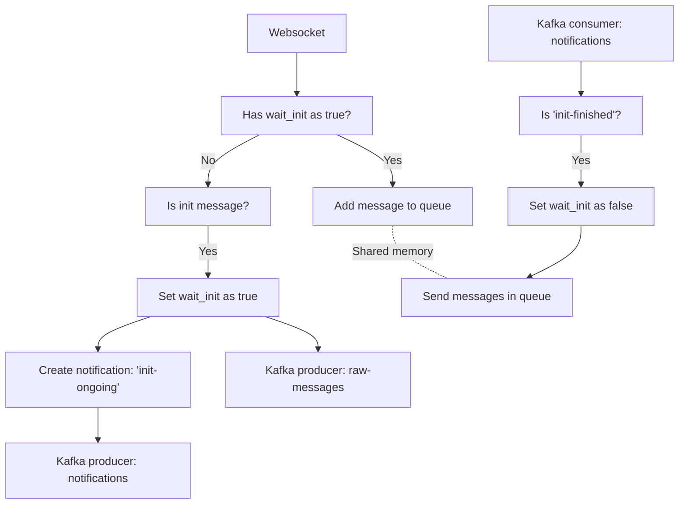
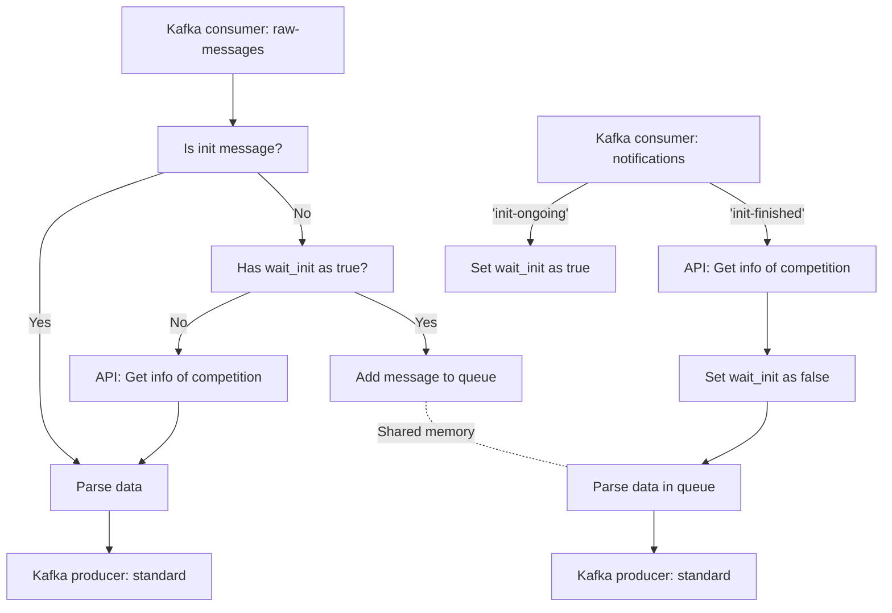
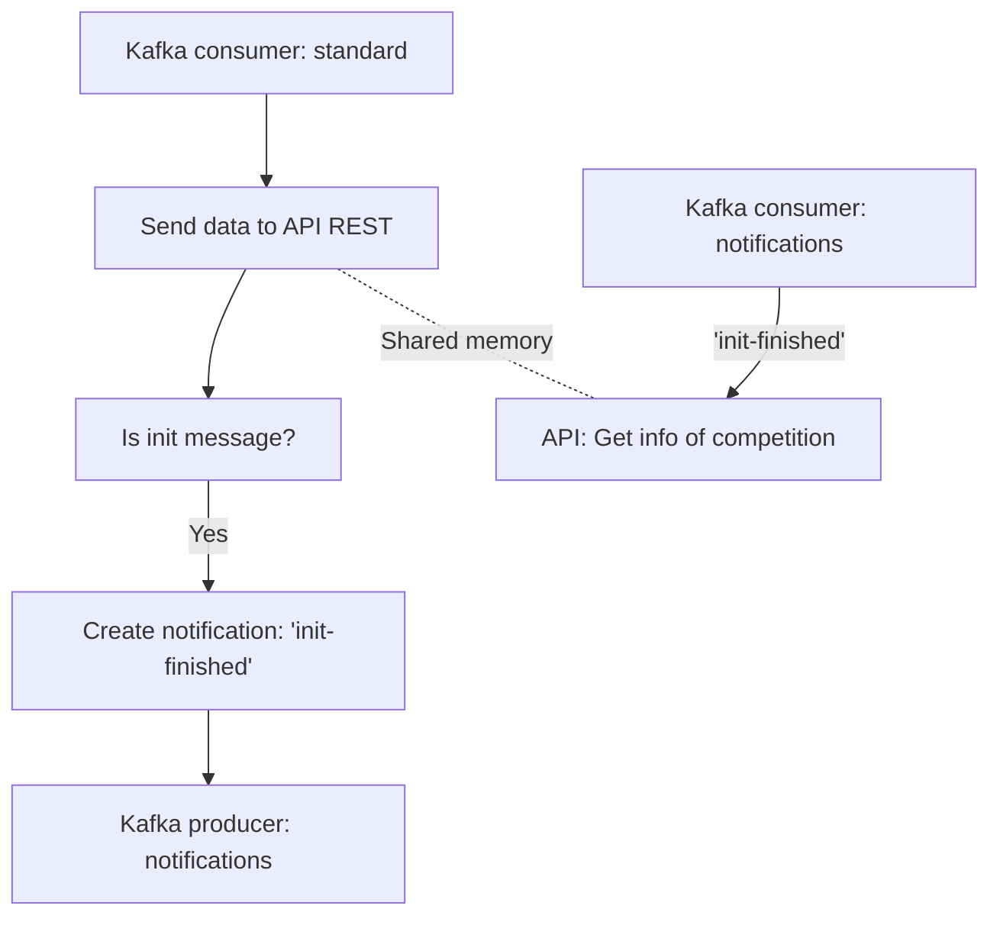

# Live Timing Strategy - Pipeline

## Introduction

Retrieves and analyses the data that comes from a live timing application.

## Setup for development

For development, we also need to install these tools:
- Python 3.9: https://www.python.org/
- (Optional) Visual Studio: https://code.visualstudio.com/

Linux:
```sh
python -m venv .venv
source .venv/bin/activate
python -m pip install tox==3.28 poetry==1.4.2
poetry config virtualenvs.create false
```

Windows:
```sh
python -m venv .venv
.\.venv\Scripts\activate
python -m pip install tox==3.28 poetry==1.4.2
poetry config virtualenvs.create false
```

> In Windows, if there is any error similar to "running scripts is disabled",
  use this command: `Set-ExecutionPolicy Unrestricted CurrentUser`.

### Adding more dependencies

Every time we add more dependencies, we'll need to update the lock file. For
this purpose, use this command while we are in the virtual env:
```sh
poetry lock --no-update
```

> Tip: in case that Poetry is slow to resolve the dependencies, try to clear its
  cache: `poetry cache clear --all <name>`

## Pipeline

### Pipeline: Websocket

The websocket step is composed by two parallel processes:
- On the one hand, one process reads the new messages from the websocket. If
  there is an initializer message, it sends a notification to all steps, so they
  wait until the initialization is completed.
- On the other hand, there is a process that reads the notifications and waits
  for the completion of the initialization.



Local Python command:
```sh
python -m ltspipe.runners.ws_listener \
  --competition_code my-competition \
  --kafka_servers localhost:9092 \
  --websocket_uri ws://www.apex-timing.com:8092 \
  --verbosity 1
```

Arguments:
- `--competition_code`: (**mandatory**) Code of the competition.
- `--kafka_notifications`: (optional) Topic of Kafka to read and write
  notifications. By default, it is `notifications`.
- `--kafka_produce`: (optional) Topic of Kafka to write messages. By default,
  it is `raw-messages`.
- `--kafka_servers`: (**mandatory**) List of Kafka brokers separated by commas.
  Example: `localhost:9092,localhost:9093`.
- `--websocket_uri`: (**mandatory**) Websocket URI to listen for incoming data.
  Example: `ws://www.apex-timing.com:8092`.
- `--verbosity`: (optional) Level of verbosity of messages. The values can be
  `0` to disable messages, `1` for debug (or greater), `2` for info (or
  greater), ... and `5` for critical. By default, it is `2`.

### Pipeline: Messages parser

The script of messages parsing is composed by two processes:
- One handles the notifications, such as the initialization, so it modifies the
  overall behaviour of parsing.
- The other is the one that parses the message data and transform it into
  something that we can store in the database.

Additionally, this script might connect to the API REST to get information, such
as settings to parse the data.



Local Python command:
```sh
python -m ltspipe.runners.parser \
  --api_lts http://localhost:8090 \
  --kafka_servers localhost:9092 \
  --verbosity 1
```

Arguments:
- `--api_lts`: (**mandatory**) URI of API REST of LTS app.
- `--errors_path`: (optional) Path to store errors during parsing. By default,
  it is `artifacts/parser/errors/`.
- `--kafka_consume`: (optional) Topic of Kafka to consume. By default, it is
  `raw-messages`.
- `--kafka_group`: (optional) Suscribe to the topic with a specific group name. 
  By default, it is `messages-parser`.
- `--kafka_notifications`: (optional) Topic of Kafka to read and write
  notifications. By default, it is `notifications`.
- `--kafka_produce`: (optional) Topic of Kafka to write messages. By default,
  it is `standard`.
- `--kafka_servers`: (**mandatory**) List of Kafka brokers separated by commas.
  Example: `localhost:9092,localhost:9093`.
- `--unknowns_path`: (optional) Path to store unknown data (i.e. not recognized
  by any parser). By default, it is `artifacts/parser/unknowns/`.
- `--verbosity`: (optional) Level of verbosity of messages. The values can be
  `0` to disable messages, `1` for debug (or greater), `2` for info (or
  greater), ... and `5` for critical. By default, it is `2`.

### Pipeline: API Sender

Similarly to the previous scripts, there are two parallel processes:
- One takes all the messages from the topic "standard" and sends them to the
  API REST (using the appropiate request).
- The other is listening for notifications. Since there might be several scripts
  of this kind, all of them must have the latest data of each competition.

Note that this script does not have any flag (locker) like the previous scripts.



Local Python command:
```sh
python -m ltspipe.runners.api_sender \
  --api_lts http://localhost:8090 \
  --kafka_servers localhost:9092 \
  --verbosity 1
```

Arguments:
- `--api_lts`: (**mandatory**) URI of API REST of LTS app.
- `--errors_path`: (optional) Path to store errors in running time. By default,
  it is `artifacts/api/errors/`.
- `--kafka_consume`: (optional) Topic of Kafka to consume. By default, it is
  `standard`.
- `--kafka_group`: (optional) Suscribe to the topic with a specific group name. 
  By default, it is `api-sender`.
- `--kafka_notifications`: (optional) Topic of Kafka to read and write
  notifications. By default, it is `notifications`.
- `--kafka_servers`: (**mandatory**) List of Kafka brokers separated by commas.
  Example: `localhost:9092,localhost:9093`.
- `--verbosity`: (optional) Level of verbosity of messages. The values can be
  `0` to disable messages, `1` for debug (or greater), `2` for info (or
  greater), ... and `5` for critical. By default, it is `2`.

### Pipeline: Raw storage

Local Python command:
```sh
python -m ltspipe.runners.raw_storage \
  --kafka_servers localhost:9092 \
  --verbosity 1
```

Arguments:
- `--kafka_servers`: (**mandatory**) List of Kafka brokers separated by commas.
  Example: `localhost:9092,localhost:9093`.
- `--kafka_consume`: (optional) Topic of Kafka to consume. By default, it is
  `raw-messages`.
- `--kafka_group`: (optional) Suscribe to the topic with a specific group name. 
  By default, it is `raw-storage`.
- `--output_path`: (optional) Path to store the raw data. By default, it is
  `./artifacts/logs`.
- `--verbosity`: (optional) Level of verbosity of messages. The values can be
  `0` to disable messages, `1` for debug (or greater), `2` for info (or
  greater), ... and `5` for critical. By default, it is `2`.

> Local GO command (WIP):
> ```sh
> go run . \
>   -mode raw_storage \
>   -output_path ./artifacts \
>   -bootstrap_servers localhost:9092
> ```

### Pipeline: Metrics computation

WIP

## Test

### Code tests

> The tests include some functional ones, thus this command requires that it
  exists an API and a database running. These tests also require that the
  environment variables file is imported.

We may run the whole test pipeline (unit tests and code style) with the
usual command:
```sh
tox
```

We may generate the coverage report (and pass the unit tests) with this command:
```sh
poe coverage
```

#### Environment variables

There is a file with some environment variables located at `.env` that we need
to run the tests. To import the environment variables, we may run this
command in Linux:
```sh
source .env.local
```

In Windows, we have to use this command instead:
```sh
Get-Content .env.local | foreach {
  $name, $value = $_.split('=')
  if (![string]::IsNullOrWhiteSpace($name) -and !$name.Contains('#')) {
    Set-Content Env:\$name $value
  }
}
```

### Pipeline: Check Kafka

Check that Kafka works correctly with a local dummy consumer:
```sh
python -m ltspipe.runners.kafka_check \
  --kafka_servers localhost:9092 \
  --kafka_topic test-topic \
  --kafka_group test-group \
  --test_mode consumer \
  --verbosity 1
```

And a local dummy producer:
```sh
python -m ltspipe.runners.kafka_check \
  --kafka_servers localhost:9092 \
  --kafka_topic test-topic \
  --test_mode producer \
  --verbosity 1
```

Note that, if we are using a different Kafka, we may need to replace the
value of `--kafka_servers` with our list of Kafka brokers (separated) by
commas.

### Pipeline: Manual listener

It is common that we want to introduce the input manually so we validate that
the whole pipeline is working correctly.

Local Python command:
```sh
python -m src.ltspipe.runners.manual_listener \
  --competition_code test-competition \
  --message_source ws-listener \
  --kafka_servers localhost:9092 \
  --verbosity 1
```

Arguments:
- `--competition_code`: (**mandatory**) Code of the competition.
- `--kafka_notifications`: (optional) Topic of Kafka to read and write
  notifications. By default, it is `notifications`.
- `--kafka_produce`: (optional) Topic of Kafka to write messages. By default,
  it is `raw-messages`.
- `--kafka_servers`: (**mandatory**) List of Kafka brokers separated by commas.
  Example: `localhost:9092,localhost:9093`.
- `--message_source`: (**mandatory**) Source of the messages to mock.
- `--verbosity`: (optional) Level of verbosity of messages. The values can be
  `0` to disable messages, `1` for debug (or greater), `2` for info (or
  greater), ... and `5` for critical. By default, it is `2`.
